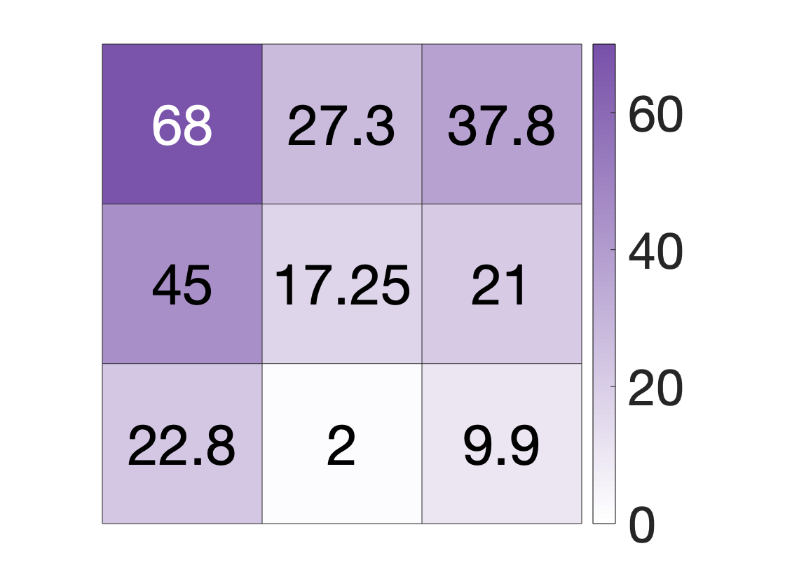

# figure_tutorial
example scripts for making figures

There are 3 eamples in the script, first produces the following plume figure:

The second, produces the following three heat maps:

The third generates a random walk, and produces a figure like this:

